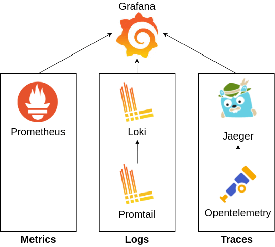
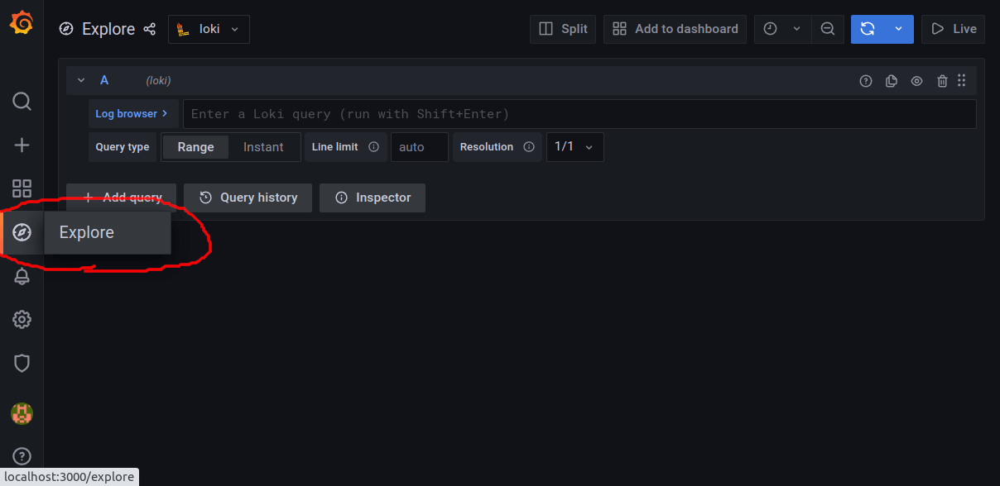
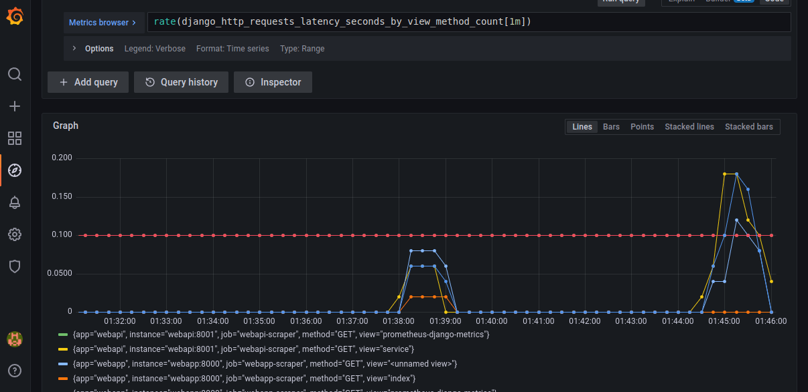
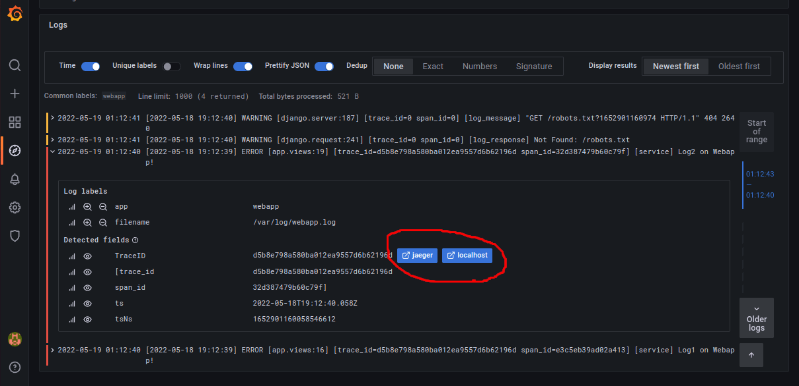
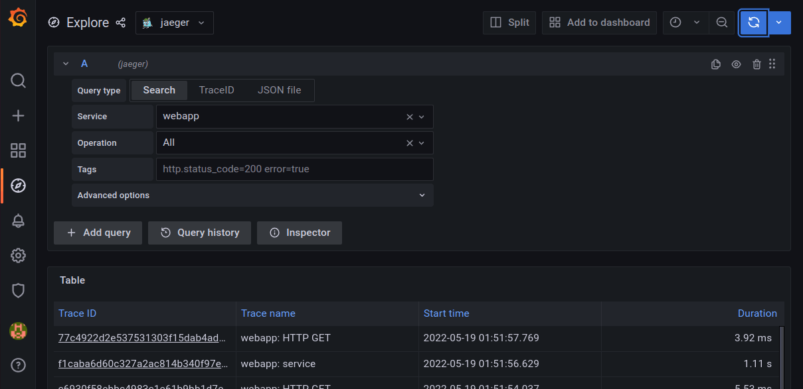
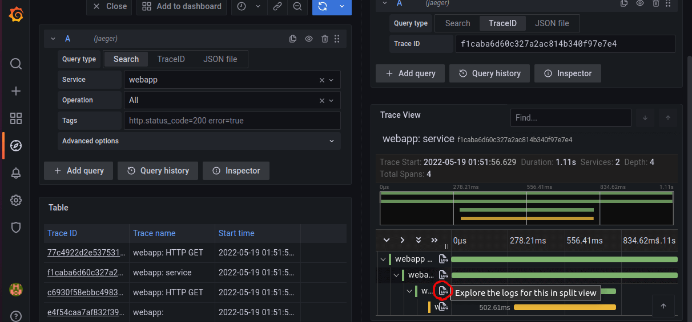

# MLT monitoring with grafana and Django-python

This project is a demonstration of how observability can be implemented in microservices/distributed systems that are built with python/django. For monitoring, the MLT observability triad is collected:
* Metrics (Prometheus -> Grafana)
* Logs (Promtail, Loki -> Grafana)
* Traces (Opentelemetry, Jaeger -> Grafana)

To see the complete blog, go to []().

Breakdown of each component that are used to collect MLT data:

1. **Grafana** _[Dashboard]_: This is a dashboard where we will observe the MLT data collected by the rest of the services.
2. **Prometheus** _[Monitoring]_: Collects and stores metrics from applications.
3. **Promtail** _[Logging]_: Collects log data from applications and sends them to Loki.
4. **Loki** _[Logging]_: Aggregates and stores all logs sent by Promtail.
5. **Opentelemetry** _[Tracing]_: Instruments an app to collect traces and sends them to Jaeger.
6. **Jaeger** _[Tracing]_: Collects and stores tracing information. Also helps in trace visualization.

The following figure summarizes the technology dependencies.



To setup the monitoring in a day, follow the steps below.

```bash
$ git clone https://github.com/mohitsharma-iitj/MLT-grafana-monitoring.git

$ cd MLT-grafana-monitoring

$ docker-compose up
```

Make some requests through postman to Django backend - webapi GET: [localhost:8001/api](http://localhost:8001/api) or POST: [localhost:8001/api/add](http://localhost:8001/api/add), to generate MLT data. Then, go to [localhost:3000](http://localhost:3000]) to view the grafana dashboard. Login using username:admin and password:admin.

Go to **explore** and you should be able to see MLT data collected from the apps. Check demo below.

### 1. Grafana dashboard


### 2. Metrics from Prometheus


### 3. Logs from Loki


### 4. Traces from Jaeger



To see the complete instruction, visit this blog, []().
